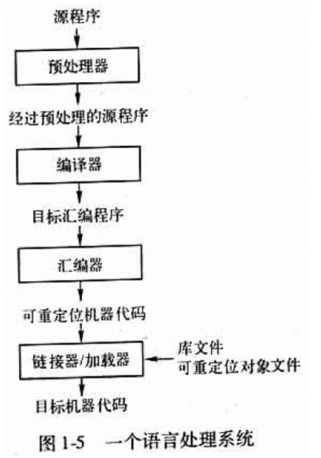

# CH1 引论

编译器：翻译一种高级语言程序（源语言）的程序成为等价的另一种低级语言程序（目标程序）的程序，并能报告源语言中错误的一种程序

解释程序：把源语言写的源程序作为输入，但不产生目标程序，而是边解释边执行源程序本身。

编译器工作的两个基本部分：
1. 分析阶段：词法、语法、语义分析，把源程序转换成中间表示
2. 综合阶段：从中间表示生成目标程序

反编译器(decompiler)：进行编译器的反向操作，把一个程序由较低的抽象形式（机器可读）转成较高的抽象形式（人工可读）。

编译器由两个部分组成
分析部分（前端）：将源程序分解成中间表示。
综合部分（后端）：根据中间表示和符号表信息来构建目标程序。

编译器的结构
1. 词法分析：从左到右扫描识别Tokens（或单词）
2. 语法分析：把Tokens组成有意义的结构（句子）
3. 语义分析：对构件进行检查保证构件的正确性

编译过程一般分为以下阶段:
- 词法分析
- 语法分析
- 语义分析
- 中间代码生成
- 优化
- 目标代码生成
