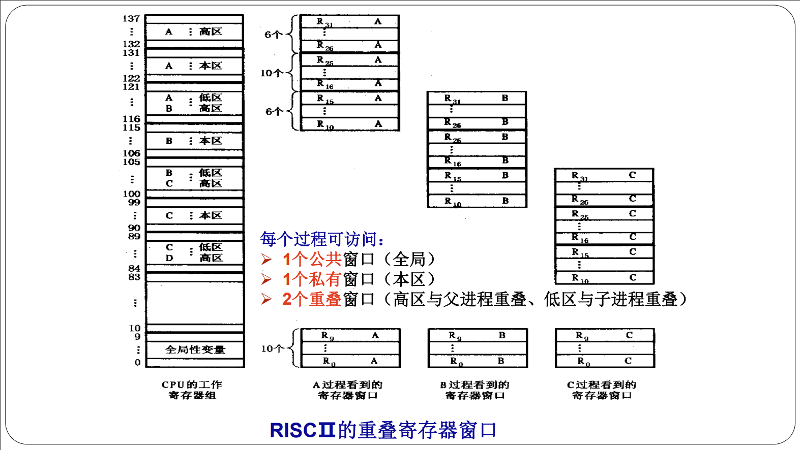
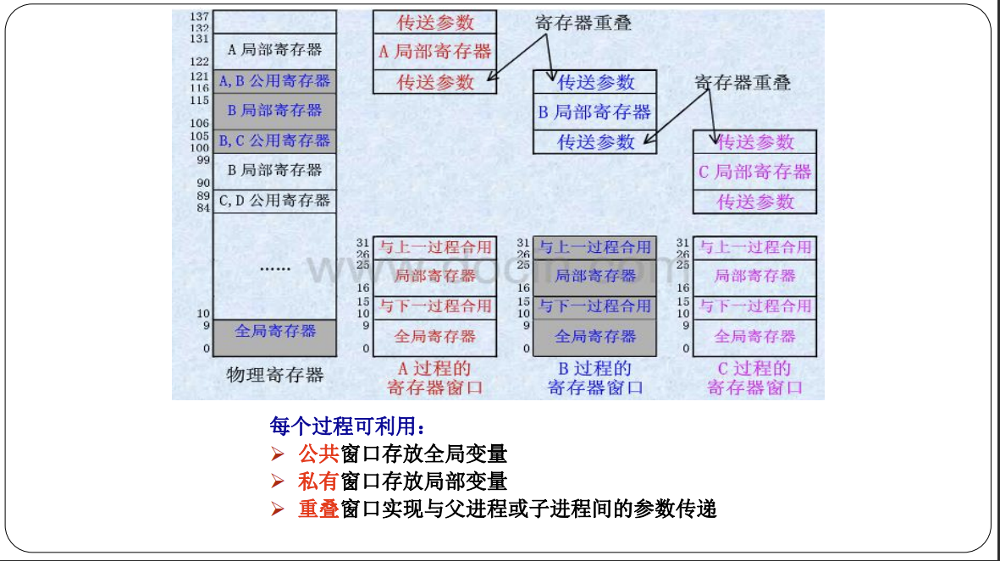

# CH2 指令系统

**指令系统的优化设计的两个截然相反的方向；**
- CISC 复杂指令系统 （硬件实现多）
	- 主要改进方向
		- 面向目标程序
		- 面向高级语言和编译
		- 面向操作系统
- RISC 精简指令系统

**RISC 的基本原则和快的实质（简答、选择）；**
- 基本原则
	- 选择使用频度较高、最有用，及实现简单的指令；
	- 每条指令都在一个机器周期内完成的指令；
	- 减少指令寻址方式的种类，简化指令格式，使指令的长度相同；
	- 增加通用寄存器的数量，减少访问存储器操作；
	- 大量采用硬联控制，提高执行速度
	- 通过优化和精简指令设计支持的编译程序，能有效地为高级语言生成机器语言程序。
- 快的实质
	- （关键）CPI，RISC比CISC少2-10倍

**RISC 采用的基本技术（简答、选择）；**
- 遵循按RISC机器一般原则设计的技术。
- 在逻辑上采用硬联实现和微程序固件实现相结合的技术。大多数简单指令用硬连线方式实现，功能较复杂的指令用微程序解释实现。
- 在CPU中设置数量较大的寄存器组，并采用重叠寄存器窗口的技术。

**重叠寄存器窗口（选择）**
- 
- 
- 效果：大量减少了原先由于程序调用引起的访存的次数
- 在主存中开辟堆栈，当调用的进程数（层数）超过规定层数时（寄存器溢出），则将溢出的部分压入堆栈中
- SUN公司的SPARC、SuperSPARC等处理机，将最后一个过程与第一个过程的公用存储器重叠起来，从而形成一个循环圈
