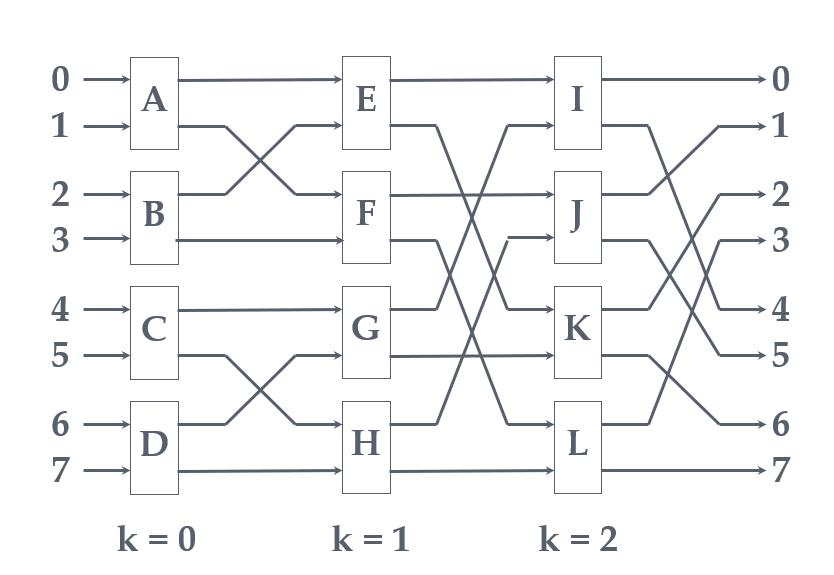
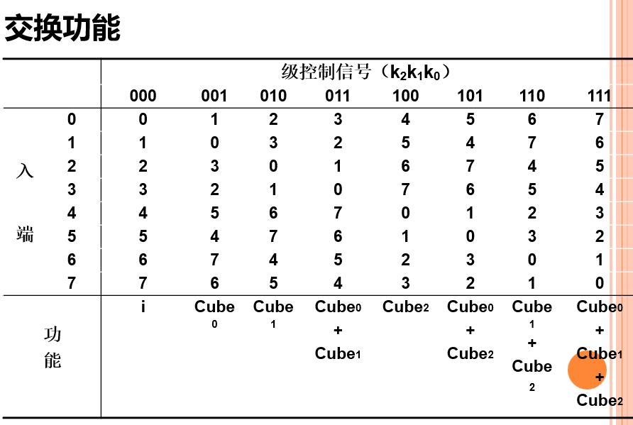

# CH4 向量处理机

**向量流水线的处理方式（选择、填空）；**
- 横向加工：按组成的元素逐个进行计算
- 纵向加工：按操作步骤分段进行所有元素的操作（存储器—存储器结构）
- 纵横处理：对向量分组，组内纵向、组间横向处理（寄存器—寄存器结构）

**向量处理机并行操作条件（选择、填空）及采用链接技术的条件（选择）；**
- 并行操作的条件：
	- 不存在向量寄存器使用冲突（不存在RAW，WAR，WAW，RAR相关）
	- 不存在功能部件使用冲突（每种功能的部件一般只设置一个）
- 采用链接技术的条件：
	- 不存在功能部件使用冲突
	- 不存在源向量寄存器冲突
	- 共用向量寄存器中向量长度、起始地址、步长均相等
	- 只有在先行指令产生第一结果分量的那个时钟方可链接，否则不行

**阵列处理机的定义（选择）；**
- 多个处理单元（PU）按照一定方式互连，在同一个控制单元（CU）控制下，对各自的数据完成同一条指令规定的操作。
- 分类
	- 分部存储器
	- 共享存储器
	- 区别：
		- ICN作用不同，分布式PE<->PE,集中式PE<->M
		- 集中式共享存储器
		- 分布式的每个PE自带存储模块（局部存储模块）	

**构成（选择）；**
- 多个处理单元PE
- 多个存储模块M
- 一个控制器CU
- 一个互连网络ICN
- 一台输入输出处理及IOP

**IlliacIV 阵列处理机结构特点（选择、填空）；**
- 分布存储器
- 闭合螺线阵列
- 任意单元的最短距离不超过 $\sqrt{N}-1$ 步，即 7 步
- 处理单元通常为累加型运算器，把累加寄存器RGA中的数据和存储器中来的数据进行运算，结果保留在累加寄存器RGA中

**互连网络的设计目标（选择、简答）；**
- 结构不要复杂，降低成本；（低成本）
- 互连灵活，满足算法和应用的需要；（高灵活性）
- 处理单元间信息交换所需最大传送步数要尽量少，提高速度；（高连接度，低延迟）
- 互连网络采用规整单一的基本构件组成；模块化，可扩充性。（适合VLSI （超大规模集成电路））

**应抉择的几个问题（选择、填空）；**
- 操作方式：同步、异步、同步与异步组合。
- 控制方式：集中、分布。
- 交换方法：线路交换、包交换、线路交换与包交换组合。
- 拓扑结构：互连网络入、出端可以连接的模式，有静态和动态两种。
	- 静态拓扑结构：两个节点间的链路是固定的
	- 动态拓扑结构：通过制定网络的开关单元状态可以重新配置
		- 单级、多级。
		- 互连函数定义，二进制编码表示，N个节点的地址为$n=log_{2}N$
- （后三个为互连网络的主要操作特征）

**操作方式（选择、填空）；**
- 同步、异步、同步与异步组合。
 
**单级互连网络及其函数（计算、选择）；**

- 立方体单级网络： $Cube_i(p_{n-1},...,p_i,...，p_1,p_0)=p_{n-1},...,\overline{p_i},...,p_1,p_0$
	- 最大连接度$log_{2}N$
	- 节点最大间距$log_{2}N$
- PM2I单级网络： $PM_{2+i}(j)=j+2^imod{N},PM_{2-i}(j)=j-2^imod{N}$
	- 效果：（+- 2i，取模）
	- 最大连接度$2n$
	- 节点最大间距$log_{2}N/2$
	- 2n个互连函数，其中2n-1种不同，只有一种函数可逆，当i=n-1时
		- 可逆的定义：输入、输出的位置可互换
- 混洗交换单级网络： $shuffle(p_{n-1},p_n,...，p_1,p_0)=p_{n-2},...,p_1,p_0,p_{n-1}$
	- 效果：循环左移
	- 节点最大间距$2n-1$
- 蝶形单级网络： $Butterfly(p_{n-1},p_n,...，p_1,p_0)=p_{0},p_{n-2}，...,p_1,p_{n-1}$
	- 效果：首尾交换

**多级互连网络的几个关键技术（选择、填空）；**
- 交换开关
- 交换开关之间的拓扑连接
- 对交换开关的不同控制方式

**交换开关分类、控制方式（选择、填空）；**
- 4种开关状态或连接方式：
	- 直连
	- 交换
	- 上播
	- 下播
- 3种控制方式：
	- 级控制：同一级的所有开关只用一个控制信号控制，同时只能处于同一种控制状态。
		- STARAN交换网
	- 单元控制：每一个开关都用自己独立的控制信号控制，可各自处于不同的状态
		- 多级混洗交换（omega）网络
	- 部分级控制：第 i 级有 i+1 种控制信号
		- STARAN移数网

**STARAN 交换网络的交换函数和互连函数、控制信号（计算、分析）；**
- 靠近输入端为小级
- 对于第i级和第i+1级之间，把$2^i+1$个开关分为一组，组内采用蝶式变换
- 
- 

**STARAN 移数网络的控制方式（填空 、选择）；**
- 控制方式：部分级控制

**多级混洗交换网络的交换开关 、控制方式 、拓扑结构（填空 、选择）；**

- 交换开关：四功能（允许实现一对多的连接）
- 控制方式：单元控制
- 拓扑结构：不同级相同，均为全混洗结构
- 连接图：第n-1级靠近入端

**并行存储器的无冲突访问（计算、选择、填空）**
- 采用多体交叉存储器--增加MEM带宽
- 对向量分组操作--解决MEM带宽小于向量带宽问
- 选择适当的存储体数m——达到无冲突访问（冗余）
- 一维向量：顺序存放，防止步长与m成比例（m取质数且与步长互质）
- 多维向量：错位存放，满足行、列、对角线等方式访问；
 	- 当 m 大于每次访问向量元素个数时，$m=2^{2P}+1$，
		- $σ1=2^P$，同一列不同行错开距离
		- $σ2=1$，同一行不同列错开距离
		- 对$A_{ab}$，体号： j=(aσ1+bσ2+C) mod m 体内序号：i=a
	- 当向量元素不固定，或非n×n时
		- 存储体数为质数，将向量变换成一维数组 S，再对 S 进行处理